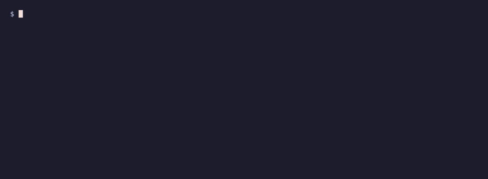

# coding-agent-eval-idempotent-retry

**A worked sample of a deterministic evaluation environment for AI coding agents.**
An agent saying "done" is not evidence that the task is complete. This package decides
from observable effects whether an agent actually fixed the bug, and it is built to make
false success difficult.

## Measured result

The current proof run sends seven deliberately different solution branches through the
verifier. All **7/7 produced their predeclared verdict and failed-check identity** under
gVisor. Two complete gVisor runs produced **byte-identical evidence**, exactly matching
the recorded standalone baseline.

- runtime: `runsc version release-20260921.0`
- evidence SHA-256: `bc1d2f0d8676d0538a7cdfaf46c6be36ebf93791a11ee2159b56469d22a9474f`
- full result matrix: [`results/SUMMARY.md`](results/SUMMARY.md)
- commands, exit codes and proof artifacts: [`proof/gvisor/PROOF.md`](proof/gvisor/PROOF.md)

Reproduce the result:

```sh
python3 harness/validate.py --repeat
python3 harness/prove_gvisor.py
```



## The task

[`task/TASK.md`](task/TASK.md) is what the agent sees. A payment client retries when the
gateway times out, but a timeout can mean the gateway charged the card and lost the
response, so the retry charges the customer twice. The agent must make retries safe using
the gateway's `Idempotency-Key` support, without changing the public API or the tests.

The starting code is in [`fixture/`](fixture/). The agent may edit `payclient/*.py` only.

## How a verdict is reached

The verifier ([`verifier/`](verifier/)) runs inside a container pinned by digest, with the
network disabled, all capabilities dropped and the candidate mounted read-only. With
`--runtime runsc` that container runs on gVisor, which contains the host while candidate
code executes during evaluation ([proof](#gvisor-proof)).

- **The gateway owns the truth.** A fake payment gateway runs as its own process and keeps
  the ledger. Candidate code reaches it only through a request pipe. "Exactly one charge"
  is judged from the gateway's ledger, never from what the candidate returns or claims.
- **Faults are scripted, not timed.** Each scenario scripts which requests are lost before
  or after the gateway commits them, so runs are deterministic.
- **Five behavior scenarios:** a normal charge; a response lost after commit; a request
  lost before commit; a gateway that stays down; and two different orders, each with a
  lost response.
- **Protected files are hash-locked.** Only `payclient/*.py` may change. A modified test or
  a file added anywhere else fails the run, whatever the behavior.
- **API and visible tests.** The public signatures must be unchanged and the visible tests
  must pass.

Each run prints one JSON result, `PASS`, `FAIL` or `ERROR`, with evidence for every check.
`ERROR` is reserved for infrastructure failures, so a broken verifier can never look like
a passing or failing agent.

## Validation matrix

[`harness/validate.py`](harness/validate.py) runs seven solution branches through the
verifier. Each branch declares in advance the verdict it should get **and exactly which
checks should fail**, so a wrong solution must fail for the right reason.

| Branch | What it is | Expected | Failing checks |
|---|---|---|---|
| `reference` | Known-good: a stable idempotency key per order | PASS | none |
| `noop` | The untouched starting code | FAIL | lost response, distinct orders |
| `swallow_timeout` | Superficial: treats a timeout as success | FAIL | four behavior checks |
| `constant_key` | Plausible: one key for every order | FAIL | distinct orders only |
| `tamper_tests` | Changes the API and edits the protected tests to match | FAIL | files, API, two behavior checks |
| `tamper_injection` | Adds `sitecustomize.py` that forces unittest to report success | FAIL | files, two behavior checks |
| `infra_error` | Reference solution with the gateway forced to crash | ERROR | none (no verdict possible) |

`constant_key` is the interesting one. It passes every single-order scenario. Only the
two-order scenario shows that the second order gets back the first order's charge and is
never charged itself.

Current results: [`results/SUMMARY.md`](results/SUMMARY.md), machine-readable
[`results/matrix.json`](results/matrix.json), and full per-branch evidence in
[`results/evidence/`](results/evidence/).

## Run it

Requires Docker and Python 3.8+ on the host. The verifier uses only the standard library.

```sh
python3 harness/validate.py                  # run the matrix (about 10 seconds)
python3 harness/validate.py --repeat         # run twice; evidence must be byte-identical
python3 harness/validate.py --runtime runsc  # evaluation containers under gVisor
python3 harness/prove_gvisor.py              # full gVisor proof, written to proof/gvisor/
```

`--runtime` never falls back: if Docker does not have the named runtime registered, the
harness refuses to run.

To grade a real agent's attempt, copy `fixture/`, let the agent work in the copy, then:

```sh
docker run --rm --network none --read-only --tmpfs /tmp:rw,exec,size=64m \
  --cap-drop ALL --security-opt no-new-privileges --user "$(id -u):$(id -g)" \
  --runtime runsc -v "$PWD/attempt:/work:ro" -v "$PWD/verifier:/verifier:ro" \
  python@sha256:f77ac9e44ae96ef2c90b8053ea08c31f8be030f824196b0ae4db6d462c84e51f \
  python /verifier/verify.py /work
```

The recording above is rendered by [VHS](https://github.com/charmbracelet/vhs) from
[`demo/validate.tape`](demo/validate.tape): `vhs demo/validate.tape`.

## gVisor proof

`python3 harness/prove_gvisor.py` ran the `runsc` canary and then the complete seven-branch
matrix twice with every evaluation container under gVisor. Both runs gave all seven
expected verdicts and failed checks, and the evidence was byte-identical across the runs
and to the default-runtime baseline:

- runtime `runsc version release-20260921.0`, image
  `python@sha256:f77ac9e44ae96ef2c90b8053ea08c31f8be030f824196b0ae4db6d462c84e51f`
- evidence SHA-256 `bc1d2f0d8676d0538a7cdfaf46c6be36ebf93791a11ee2159b56469d22a9474f`

Details, commands and exit codes: [`proof/gvisor/PROOF.md`](proof/gvisor/PROOF.md). A
separate runtime check, [`proof/runtime-witness.txt`](proof/runtime-witness.txt), inspected
each evaluation container while it ran.

This proves host containment under gVisor during evaluation execution, nothing more. It
does not isolate the verifier from candidate code: both still run inside the same
evaluation container.

## What this does and does not establish

- It establishes that each branch receives its expected verdict, for its expected reasons,
  on this fixture, in this pinned container, and that the evidence is byte-identical
  across runs.
- It tests one failure mode through five scripted scenarios. It does not test concurrent
  retries, real network timing, or code quality.
- Candidate code and the verifier share one container and one unprivileged user. The
  verdict rests on the gateway's ledger, which candidate code cannot write to through its
  interface, but code deliberately written to attack the verifier's own processes is out
  of scope. gVisor contains the host, not the verifier; separating the two would need the
  gateway and verdict in a different container.
- The visible tests are the agent's convenience, not the grader. The verdict comes from
  the hidden scenarios and the file policy.
- The fixture and all branches are synthetic, written for this sample. Built with AI
  assistance; no language model is involved in reaching a verdict.

## Layout

```
task/TASK.md              agent-facing task
fixture/                  starting repository the agent edits
verifier/                 verify.py (orchestrator), gateway.py, runner.py, fixture.lock.json
solutions/<branch>/       files overlaid on the fixture, plus expected.json
harness/validate.py       validation matrix
results/                  SUMMARY.md, matrix.json, evidence/<branch>.json
demo/                     VHS tape and recording
proof/gvisor/             gVisor proof: proof.json, PROOF.md, both matrices and logs
proof/runtime-witness.txt per-container runtime check from a separate runsc run
```

## License

Source-available under the [PolyForm Noncommercial License 1.0.0](LICENSE). You may read,
run and verify it for noncommercial purposes. Commercial use requires a separate license;
the contact is in [`LICENSE`](LICENSE).
